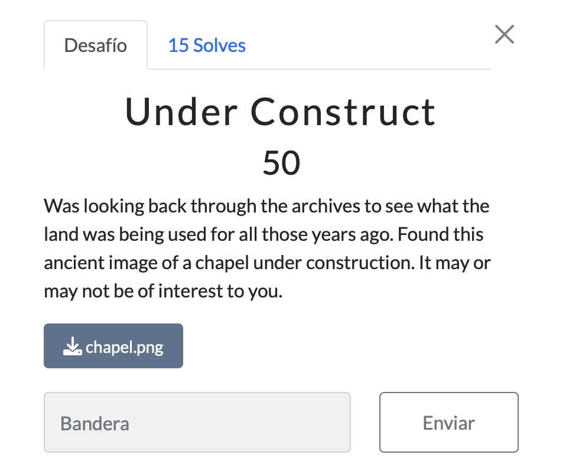

# Forensics Writeup

## Table of Contents

- [Forensics Writeup](#forensics-writeup)
  - [Table of Contents](#table-of-contents)
    - [In Plain Sight](#in-plain-sight)
    - [Under Construct](#under-construct)
    - [Desist](#desist)
    - [(Lack of) Authority](#lack-of-authority)
    - [Can You Hear the Music?](#can-you-hear-the-music)

### In Plain Sight


[in_plain_sight.jpg](files/in_plain_sight.jpg)

We tried opening the given image and looks like there is nothing in the image. So we tried using `strings` command to see if there is any hidden text in the image.

```bash
strings in_plain_sight.jpg
```
We got nothing from the strings command. So we tried using `binwalk` to see if there is any hidden files in the image.

```bash
binwalk in_plain_sight.jpg
```
And we got nothing too 😅. So we tried with `steghide` to see if there is any hidden files in the image.

```bash
steghide extract -sf in_plain_sight.jpg
```

With no password we got the file `flag.txt` and the content of the file is 
`# almost there!
c3BhcnRhbkNURntoMWRkZW5fMW5fcGxhMW5fc2lnaHRfYWJiNTA2NWF9Cg==`

We can see that the content is base64 encoded. So we decoded the content using `base64` command.

```bash
echo "c3BhcnRhbkNURntoMWRkZW5fMW5fcGxhMW5fc2lnaHRfYWJiNTA2NWF9Cg==" | base64 -d
```

And we got the flag

> `spartanCTF{h1dden_1n_pla1n_sight_abb5065a}`


### Under Construct

<!--  Was looking back through the archives to see what the land was being used for all those years ago. Found this ancient image of a chapel under construction. It may or may not be of interest to you. -->



[chapel.png](files/chapel.png)

Not solved :c

### Desist

<!-- Some punk keeps on trying to pressure us to taking down our website with these bogus cease and desist letters. Would you mind looking at one to see if you can figure out who is really sending them? -->


[letter_v2.pdf](files/letter_v2.pdf)

We took a quick look at the pdf and not much information was found. So we tried using `strings` command to see if there is any hidden text in the pdf.

```bash
strings letter_v2.pdf | grep CTF
```


And we got the flag

> `spartanCTF{n3v3r_f0rget_th3_m3tadata_5b1bfc6e}`

### (Lack of) Authority

<!-- I'm trying to get the new website up and running. The only problem is that I can't seem to get anyone to sign my SSL cert. Can you figure out why no CAs will take it? -->


[cert.pem](files/cert.pem)

We took a quick look at the pem file and there is the flag in the file.


> `spartanCTF{w3lc0me_t0_th3_w0rld_0f_auth0r1ty}`

### Can You Hear the Music?

<!-- We hired a freelancer off of the Internet to produce some on-hold music for our phone lines. It seems like the file we received though is partially corrupted. Could you take a look at the audio and see what's up? -->

[can_you_hear_the_music.wav](files/can_you_hear_the_music.wav)

We tried opening the given audio file and sounds like a `DTMF` tone in the background. So we tried using `Audacity` to see if there is any hidden text in the audio file.

We found nothing in the audio file. So we tried using [`DTMF` ](https://dtmf.netlify.app/) decoder to see if there is any hidden text in the audio file.

And we got this `Decoded: 1151129711411697110678470123108511169510951951045211851959711712095110511201169511649109101955652985151989748125`

We can see that the content is decimal encoded. So we decoded the content `ASCII Decoder` and we got the flag.


And we got the flag

> `spartanCTF{l3t_m3_h4v3_aux_n3xt_t1me_84b33ba0}`