# Interactive Writeup

## Table of Contents

- [Interactive Writeup](#interactive-writeup)
  - [Table of Contents](#table-of-contents)
    - [Talk to Me \[I\]](#talk-to-me-i)
    - [Talk to Me \[II\]](#talk-to-me-ii)
    - [Talk to Me \[III\]](#talk-to-me-iii)
    - [Eightyfour](#eightyfour)
    - [Chocolate Chocolate Chip](#chocolate-chocolate-chip)
    - [Excavator](#excavator)
    - [Destroy After Use](#destroy-after-use)

### Talk to Me [I]

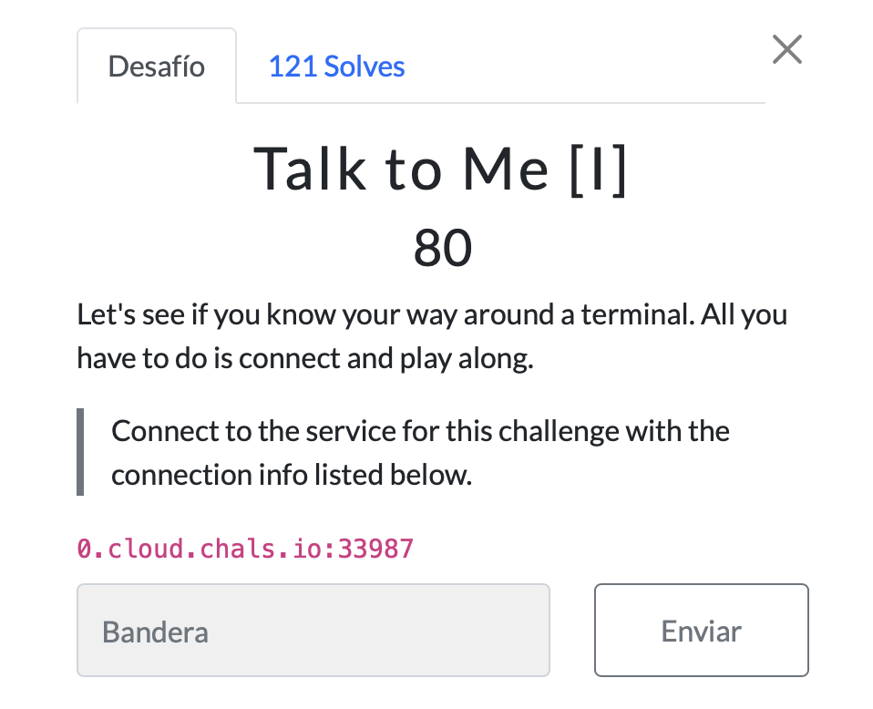

```0.cloud.chals.io:33987```

We are given a URL and a port number. We tried to connect to the given URL and port number using `nc` command.

```bash
nc 0.cloud.chals.io 33987
```
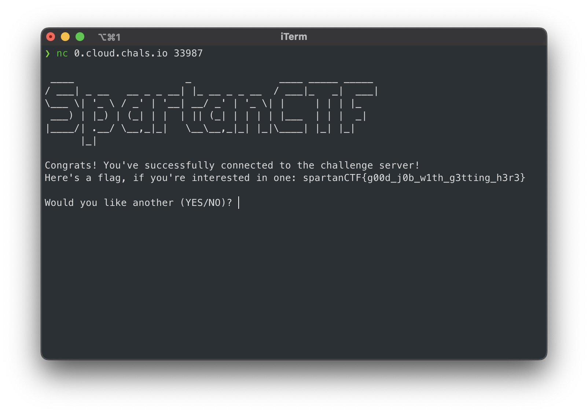

And we got the flag

> `spartanCTF{g00d_j0b_w1th_g3tting_h3r3}`

### Talk to Me [II]

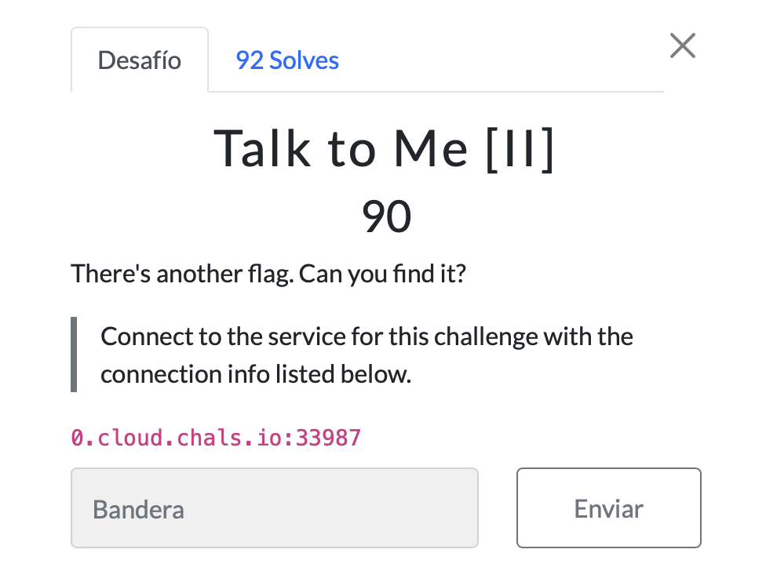

```0.cloud.chals.io:33987```

We are given a URL and a port number. We tried to connect to the given URL and port number using `nc` command.

```bash
nc 0.cloud.chals.io 33987
```

Then we input YES and we got a lot of text. We tried `Ctrl + F | Cmnd + F` to search for the flag.

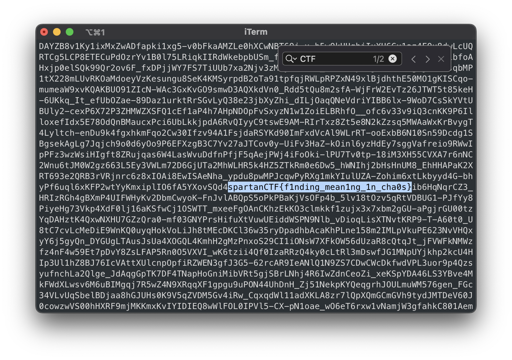

And we got the flag

> `spartanCTF{f1nding_mean1ng_1n_cha0s}`

### Talk to Me [III]

<!-- There's (yet) another flag.

Connect to the service for this challenge with the connection info listed below. -->

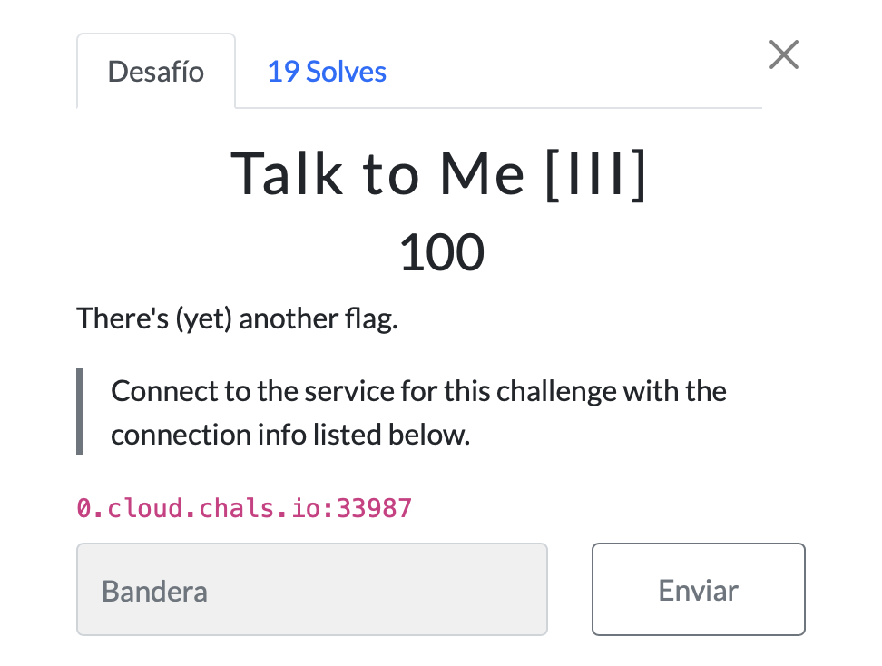

```0.cloud.chals.io:33987```

Not solved :c 

### Eightyfour

<!-- We're writing like a reverse CAPTCHA system. Something that only machines will be able to work through. It's almost production ready. Please help us test it out.

Connect to the service for this challenge with the connection info listed below. -->

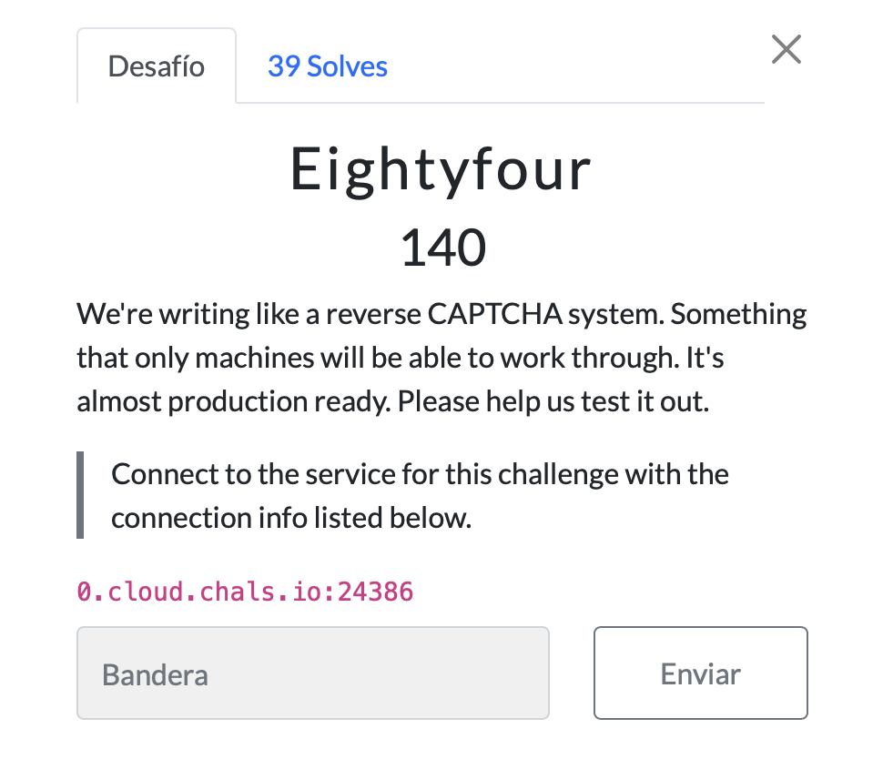

```0.cloud.chals.io:24386```

We are given a URL and a port number. We tried to connect to the given URL and port number using `nc` command.

```bash
nc 0.cloud.chals.io 24386
```
The server sends us a string with a operation to do. We have to solve the operation and send the result to the server. But the server needs the result so fast that we can't solve it manually. So we have to write a script to solve the operation and send the result to the server.

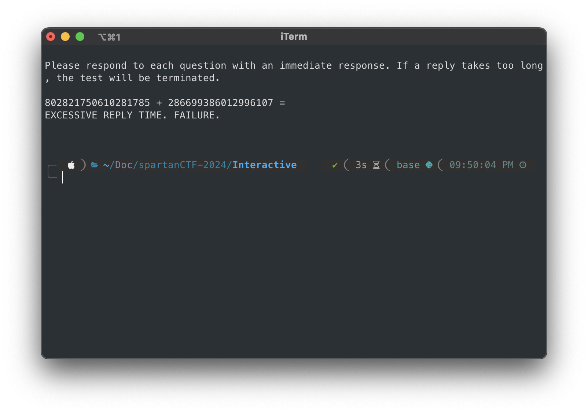

We wrote a python script to solve the operation and send the result to the server.

<!-- Show the script from scripts/140.py -->
[Eightyfour.py](scripts/Eightyfour.py)

<!-- show the full script -->
```python
import socket

payloadExample = """Launching computational intelligence benchmarks.

Please respond to each question with an immediate response. If a reply takes too long, the test will be terminated.

469781228248661089 + 956089083196549134 = 2342342352"""

def solve_challenge():
    # Connect to the server
    server_address = ('0.cloud.chals.io', 24386)
    with socket.create_connection(server_address) as sock:
        while True:
            # Receive the challenge
            challenge = sock.recv(1024).decode()
            print(challenge)
            s = "NO COMPUTATIONAL ERRORS DETECTED. TEST SUCCESS."
            if s in challenge:
                sock.sendall(b"2\n")
                print(sock.recv(1024).decode())
                break
            #wait for the challenge
            while " = " not in challenge:
                challenge = sock.recv(1024).decode()
                print(challenge)
            print(challenge)
            # Extract onyl the numbers from the challenge
            numbers = [int(n) for n in challenge.split() if n.isnumeric()]
            # print(numbers)
            # Calculate the sum of the numbers
            result = sum(numbers)
            print(result)
            # Send the result back to the server
            sock.sendall(f"{result}\n".encode())

if __name__ == "__main__":
    solve_challenge()
```

We ran the script 

```bash
python Eightyfour.py
```

And we got the flag

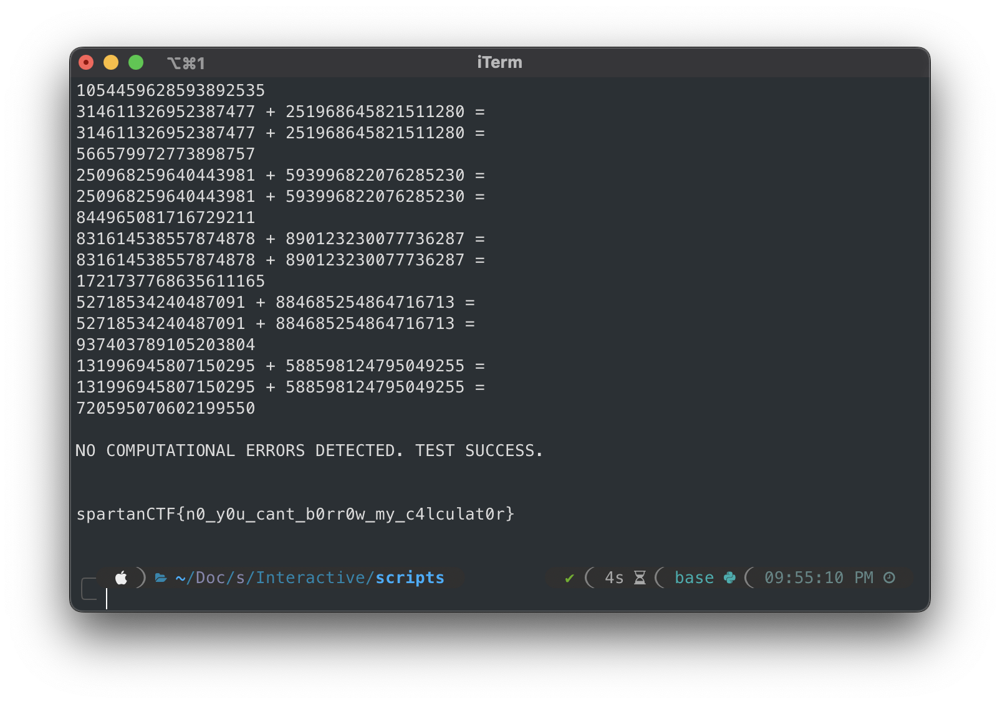

> `spartanCTF{n0_y0u_cant_b0rr0w_my_c4lculat0r}`

### Chocolate Chocolate Chip

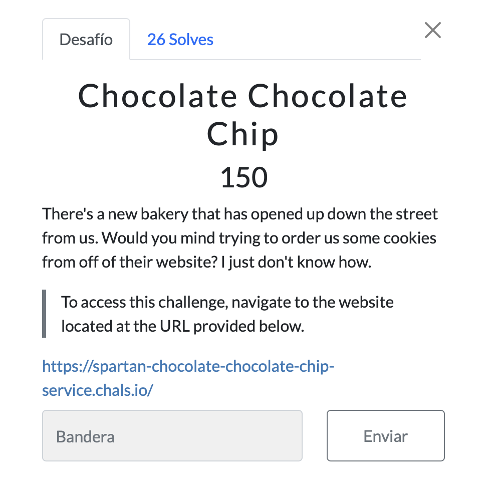

[Chocolate Chocolate Chip](https://spartan-chocolate-chocolate-chip-service.chals.io/)

We are given a URL. We visited the URL and inspected the page source but we didn't find anything useful. 

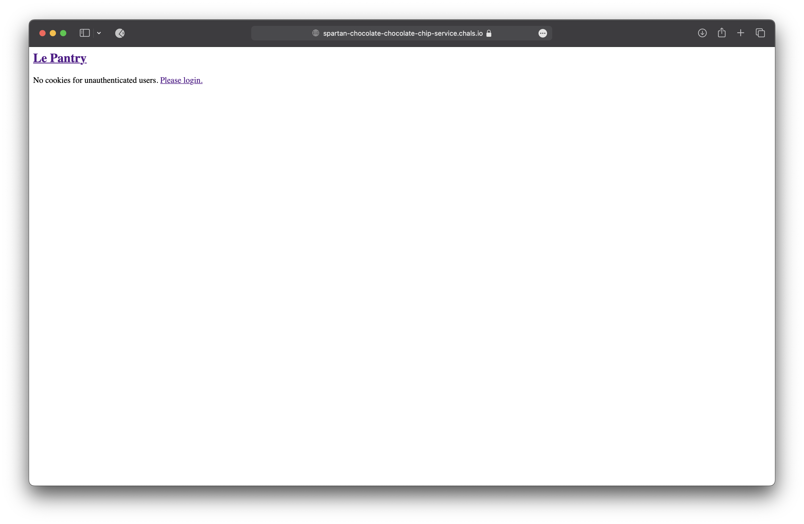

We click on the `Login` button and we redirected to the login page. But apparently isn't working the login page.

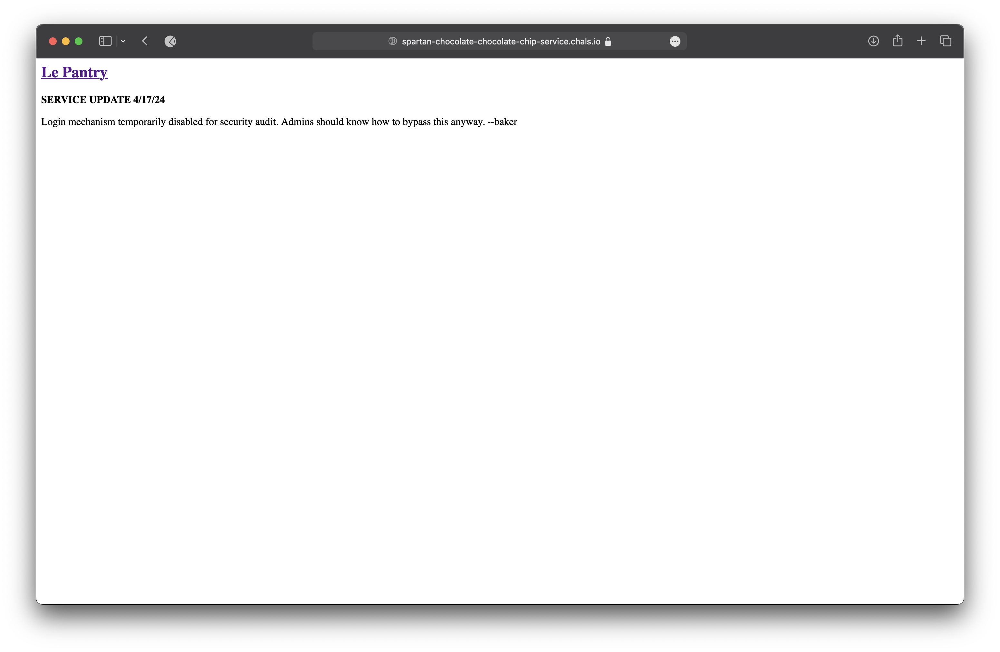

Getting nothing from the login page, we tried to visit the `robots.txt` file but oh no, we got a `404 Not Found` error.

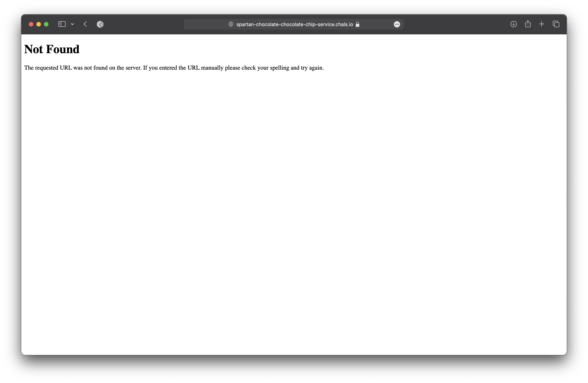

We tried to visit the `flag.txt` file but the same as the `robots.txt` file, we got a `404 Not Found` error.

So we tried to visit many other pages like `admin`,`panel`,`dashboard`,`console`,`cookie` but we got a `404 Not Found` error.

So we thaught found in the `cookies` and we found a cookie named `session` with a value `eyJ1c2VyIjoiZ3Vlc3QifQ.ZiXlWg.8ANR-mvIi8sCngWDeZHfxJ4PXX4`.

We decoded using `base64` the value of the cookie and we got `{"user":"guest"}`.

Confirming the value of the cookie, we used `flask-unsign` to decode the value of the cookie.

```bash
flask-unsign --decode --cookie 'eyJ1c2VyIjoiZ3Vlc3QifQ.ZiXlWg.8ANR-mvIi8sCngWDeZHfxJ4PXX4'
```

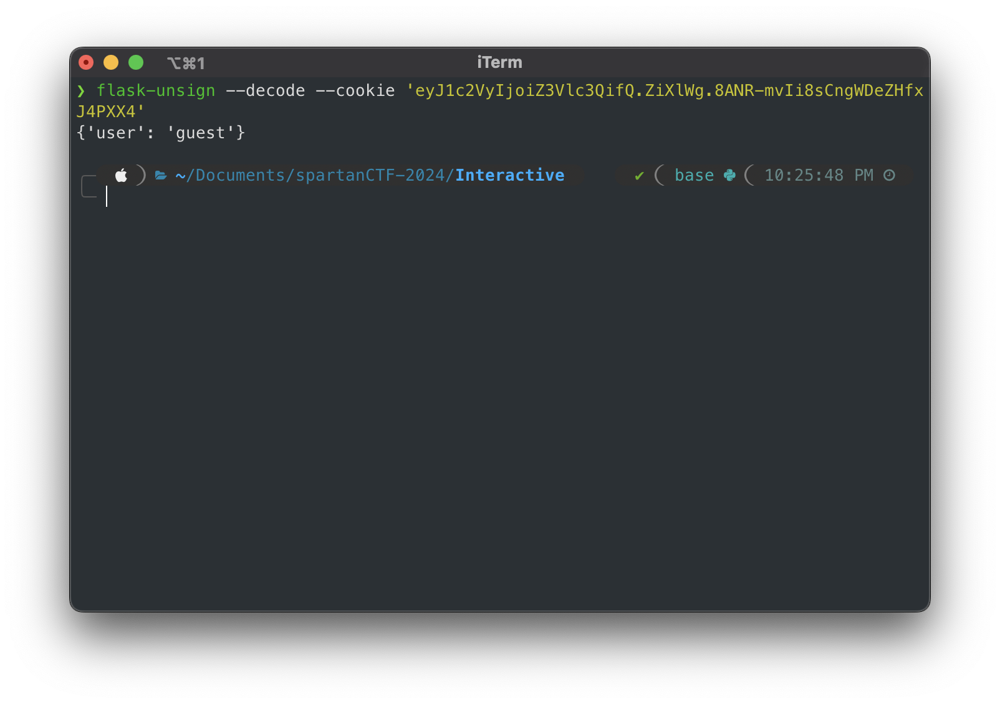

[Flask-Unsign Hat Tricks](https://book.hacktricks.xyz/network-services-pentesting/pentesting-web/flask#decoder)

We used the `flask-unsign` tool to decode the value of the cookie and we got the flag.

Trying with

```bash
flask-unsign --unsign --cookie 'eyJ1c2VyIjoiZ3Vlc3QifQ.ZiXlWg.8ANR-mvIi8sCngWDeZHfxJ4PXX4'
```

Than use the default dictionary to decode the value of the cookie.But we got nothing.

So in the `Hat Tricks` we found that we can use the `--wordlist` option to decode the value of the cookie and in Github we found a dictionary with the most common words.

[RockYou List](https://www.google.com/url?sa=t&source=web&rct=j&opi=89978449&url=https://github.com/brannondorsey/naive-hashcat/releases/download/data/rockyou.txt&ved=2ahUKEwjg9rnh_tSFAxWs6ckDHTkmD94QFnoECAYQAQ&usg=AOvVaw3snAERl1mU6Ccr4WFEazBd)


```bash
flask-unsign --unsign --wordlist rockyou.txt --cookie 'eyJ1c2VyIjoiZ3Vlc3QifQ.ZiXlWg.8ANR-mvIi8sCngWDeZHfxJ4PXX4' --no-literal-eval
```

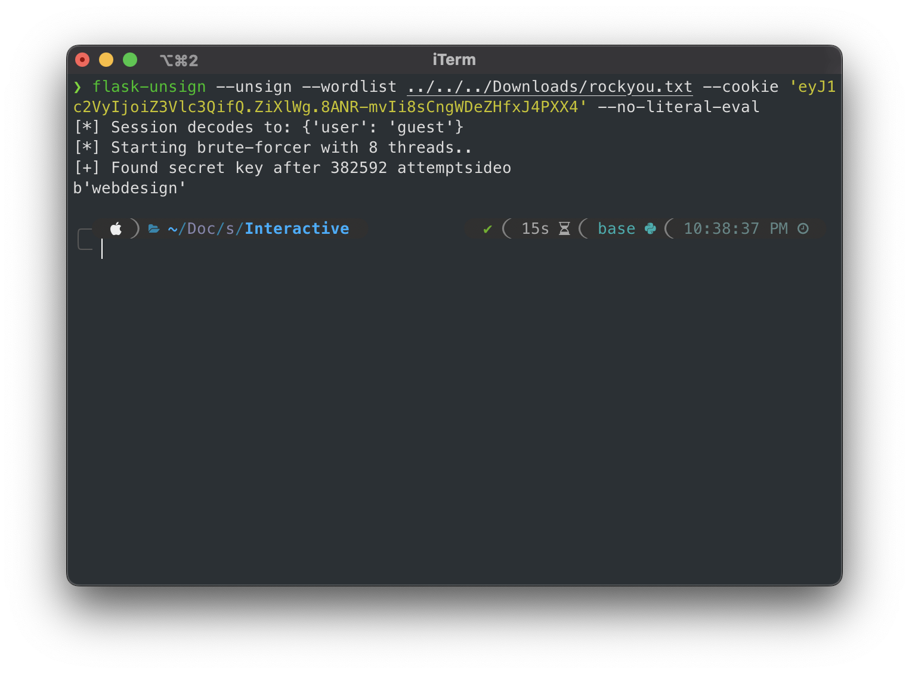

And we got the sign of the cookie than is `webdesign`.

We tried `spartanCTF{webdesign}` but it didn't work.

So we tried to make a new cookie with
  
```bash
flask-unsign --sign --cookie '{"user":"admin"}' --secret webdesign
```

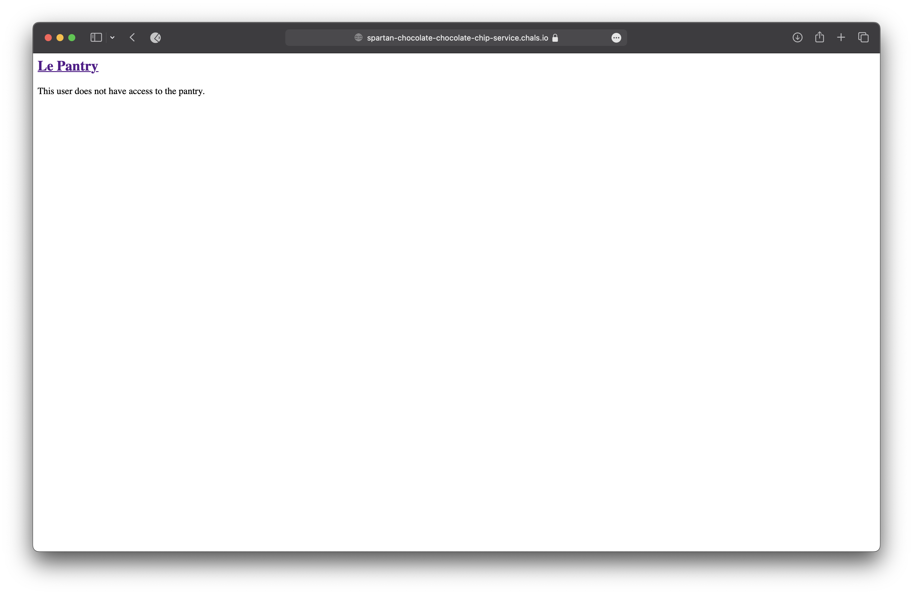

We din't get the flag but almost a chabge in the website.

So we tried be the `baker`.

```bash
flask-unsign --sign --cookie '{"user":"baker"}' --secret webdesign
```

Cookie value: `eyJ1c2VyIjoiYmFrZXIifQ.ZiXrKw.Jn3PbEhW6KLvG3RRhNQoAPaDrLo`

So we think so finally we got the flag.

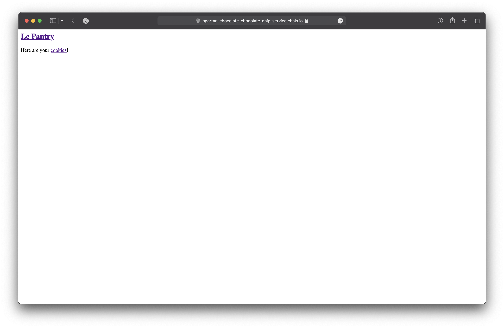

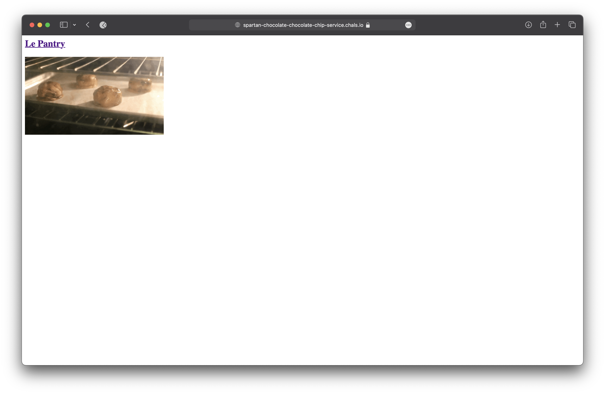

We like ahh just kidding right?
So we check cookies again and we found a cookie session with a value `eyJjb29raWUiOiJjaG9jb2xhdGVfY2hpcCIsImZsYWciOiJzcGFydGFuQ1RGezN2M3J5X2IwZHlfbDB2ZXNfYV9jMDBrMWV9IiwidXNlciI6ImJha2VyIn0.ZiXsCQ.K7ZK0-Y8UMmV-xxZ9VMUTmcHw8s`.

We decoded the value of the cookie using `flask-unsign` and we got the flag.

```bash
flask-unsign --decode --cookie 'eyJjb29raWUiOiJjaG9jb2xhdGVfY2hpcCIsImZsYWciOiJzcGFydGFuQ1RGezN2M3J5X2IwZHlfbDB2ZXNfYV9jMDBrMWV9IiwidXNlciI6ImJha2VyIn0.ZiXsCQ.K7ZK0-Y8UMmV-xxZ9VMUTmcHw8s'
```

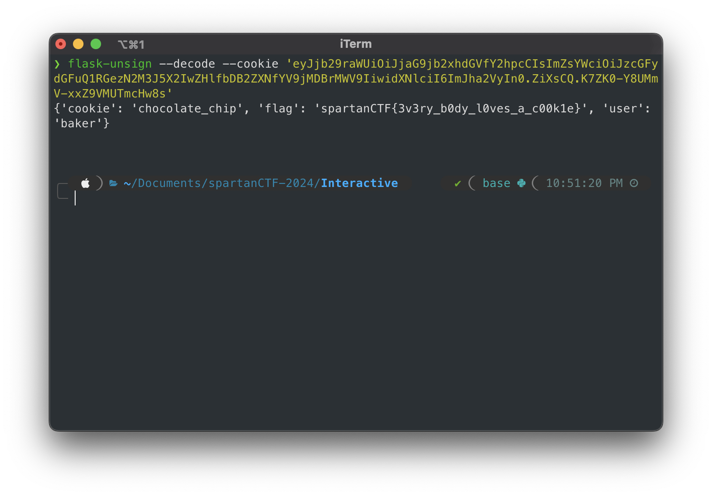

And finally after a lot of tries we got the flag.

> `spartanCTF{3v3ry_b0dy_l0ves_a_c00k1e}`
### Excavator 

<!-- Excavator
150
A local businessowner reached out to the club; they want us to take a look at their website. Would you mind seeing if there's any glaring security flaws?

To access this challenge, navigate to the website located at the URL provided below.

https://spartan-excavator-service.chals.io/ -->

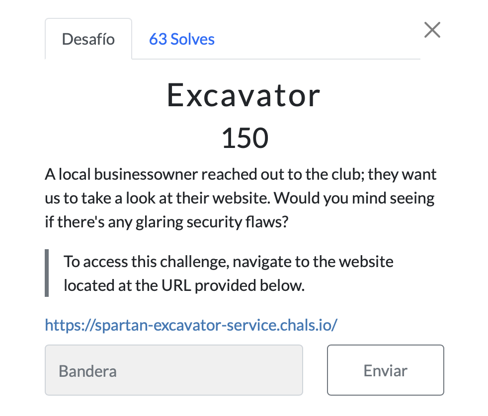

[Excavator](https://spartan-excavator-service.chals.io/)

We are given a URL. We visited the URL and inspected the page source but we didn't find anything useful.

So we tried to visit the `robots.txt` file and we got some directories.

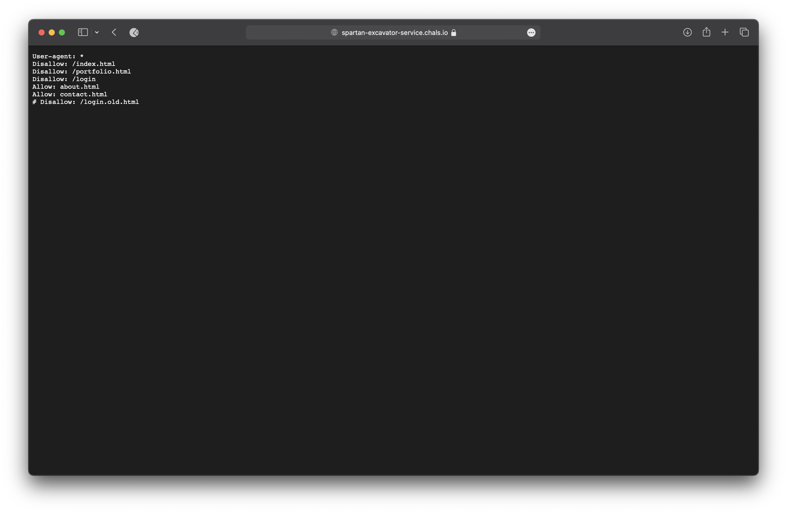

We visited the `/login.old.html` page and inspected the page we found some code.

```html
  <script>
    
      function authenticate(){
        var authorised;
        
        var username = document.getElementById("username").value;
        var password = document.getElementById("password").value;

        if(username == "ExcavationAdmin" && btoa(password) == "U3VwM3JTM2N1cmVQYXNzdzByZDE="){
          authorised = true;
        }else{ 
          authorised = false;
          alert("Sorry, credentials are incorrect.");
        }
        //return result
        return authorised;
      }
    </script>
```

We found the username and password. The username is `ExcavationAdmin` and the password is `U3VwM3JTM2N1cmVQYXNzdzByZDE=`.

We decoded the password using `base64` and we got the password `Sup3rS3curePassw0rd1`.

We tried to login with the username `ExcavationAdmin` and the password `Sup3rS3curePassw0rd1` and we redirected to the ´/index.html´ page.

So we tried to visit the `/login.html` page using the username `ExcavationAdmin` and the password `Sup3rS3curePassw0rd1` and we got the flag.

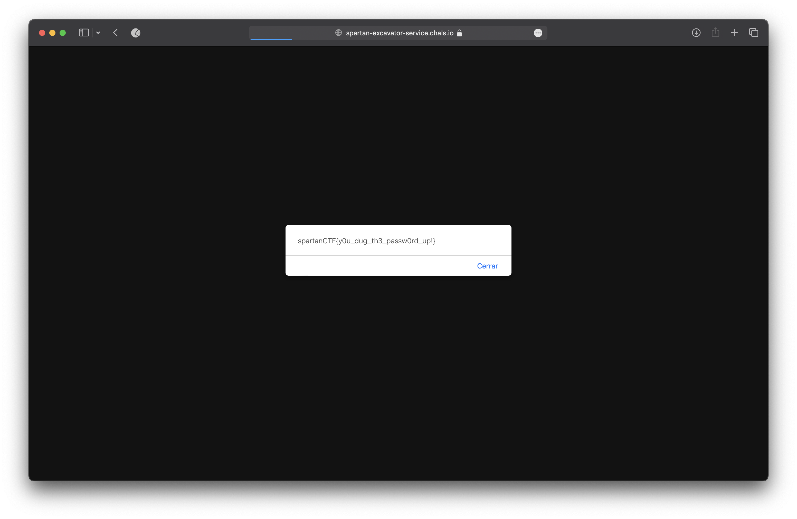

> `spartanCTF{y0u_dug_th3_passw0rd_up!}`

### Destroy After Use

Not solved :c
