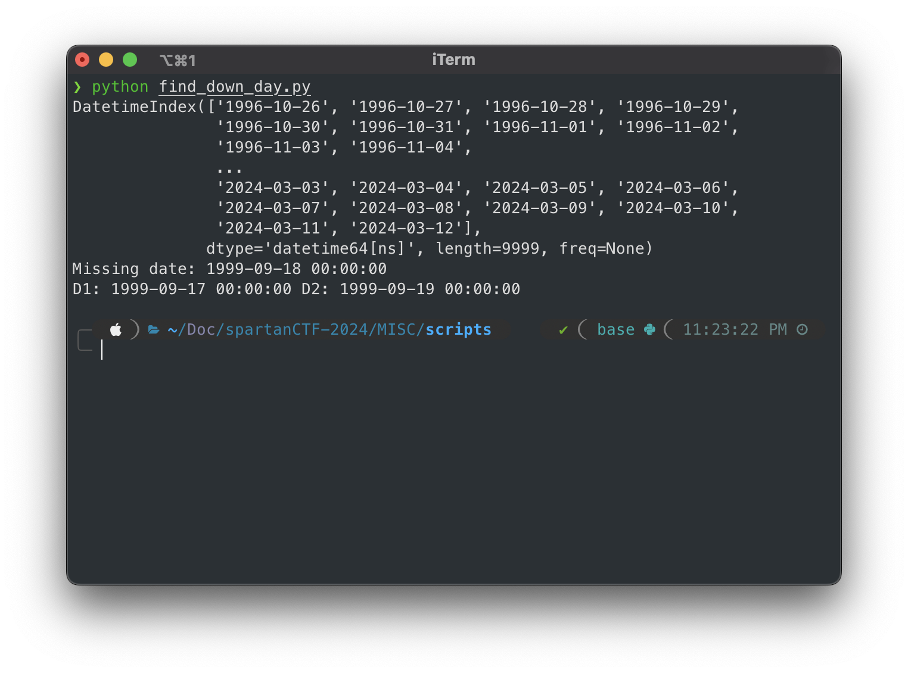
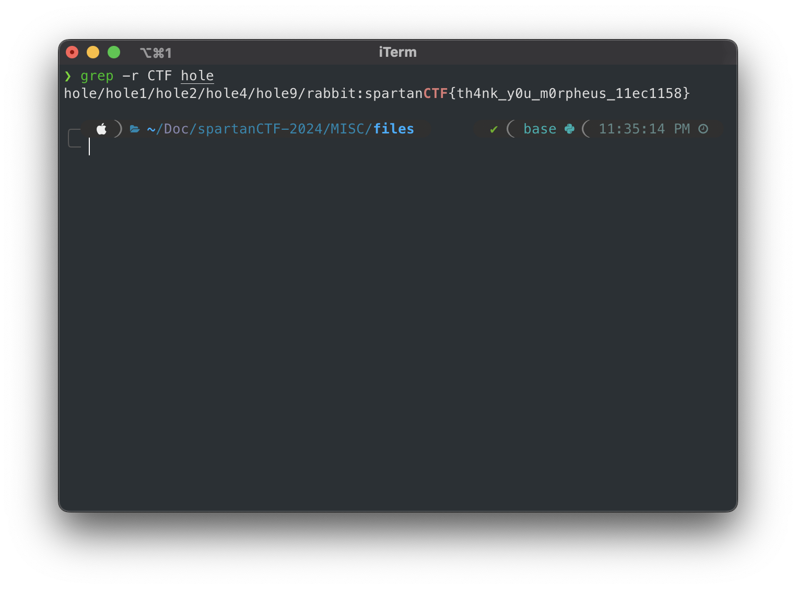

# MISC

## Table of Contents

- [MISC](#misc)
  - [Table of Contents](#table-of-contents)
    - [Day by Day](#day-by-day)
    - [Down the Rabbit Hole](#down-the-rabbit-hole)
    - [Bittwersweet](#bittwersweet)

### Day by Day

Given a file `dates.csv` with many dates than represent the days of a system has been up. Find the one day that the system was down.

We use a python script to find the day that the system was down.

```python
import numpy as np
import pandas as pd

#import dates from dates file
dates = pd.read_csv('./dates.csv', header=None)
# sort the dates
np_dates = np.sort(dates[0].values)
#convert the numbers in dates to datetime
np_dates = pd.to_datetime(np_dates, format='%Y%m%d')
print(np_dates)
#find the day than doesn't exist in the array of dates
for i in range(1, len(np_dates)):
    if np_dates[i] - np_dates[i-1] != pd.Timedelta(days=1):
        print(f"Missing date: {np_dates[i-1] + pd.Timedelta(days=1)}")
        print(f"D1: {np_dates[i-1] } D2: {np_dates[i]}")
        break
```

We run the script and we got the day that the system was down.

```bash
python3 find_down_day.py
```



> `spartanCTF{19990918}`


### Down the Rabbit Hole

We are given a file `hole.zip` and we need to find the flag in the nested zip files.

We use a python script to extract the zip files and find the flag.

```python
import zipfile, re, os

def extract_nested_zip(zippedFile, toFolder):
    """ Extract a zip file including nested zip files
        Delete the zip file(s) after extraction
    """
    with zipfile.ZipFile(zippedFile, 'r') as zfile:
        zfile.extractall(path=toFolder)
    os.remove(zippedFile)
    for root, dirs, files in os.walk(toFolder):
        for filename in files:
            if re.search(r'\.zip$', filename):
                fileSpec = os.path.join(root, filename)
                extract_nested_zip(fileSpec, root + '/' + filename.split('.')[0])

# Extract the zip file
extract_nested_zip('hole.zip', 'hole')
```

We run the script and we unzip the files and we find the flag.

```bash
python3 extract_zip.py
```
With a simple `grep` we find the flag.

```bash
grep -r CTF hole
```



And there is the flag.

> `spartanCTF{th4nk_y0u_m0rpheus_11ec1158}`

### Bittwersweet

We are given a file `jingle.jpg` and we need to find the flag in the secret puzzle.


`The format of the flag is spartanCTF{flag}`

Not solved :c
