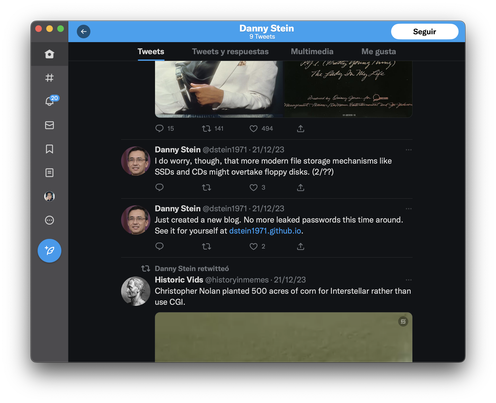

# OSINT Writeup

## Table of Contents

- [OSINT Writeup](#osint-writeup)
  - [Table of Contents](#table-of-contents)
  - [Touch Base](#touch-base)
  - [Evesdropper](#evesdropper)
  - [Recovery](#recovery)
  - [Hide and Seek](#hide-and-seek)
  

## Touch Base


<!-- Add link -->

Link to the [Web Site](https://sites.google.com/sstx.org/zdc/home)


Using the curl command to get the content of the website and then using grep to search for the flag.

```bash
 curl https://sites.google.com/sstx.org/zdc/home | grep -Eo '(.{0,10}CTF{[^}]*}).{0,50}'
```


And the're is the flag.

> `spartanCTF{w3lc0m3_t0_th3_c1ub_bb78d66e}`


## Evesdropper


```
BEGIN CIPHERTEXT 78 105 99 101 32 106 111 98 32 114 101 99 111 110 103 105 122 105 110 103 32 65 83 67 73 73 44 32 98 117 116 32 116 104 105 115 32 119 97 115 32 106 117 115 116 32 97 32 114 101 100 32 104 101 114 114 105 110 103 33 32 82 101 109 101 109 98 101 114 44 32 104 97 99 107 105 110 103 32 105 115 32 97 98 111 117 116 32 102 105 110 100 105 110 103 32 116 104 101 32 101 97 115 105 101 115 116 32 119 97 121 32 116 111 32 103 101 116 32 116 104 101 32 100 97 116 97 32 121 111 117 32 110 101 101 100 46 32 73 110 32 97 32 114 101 97 108 32 119 111 114 108 100 32 115 99 101 110 97 114 105 111 44 32 121 111 117 32 109 105 103 104 116 32 116 114 121 32 103 111 111 103 108 105 110 103 32 66 111 98 32 116 111 32 115 101 101 32 119 104 111 32 104 101 39 115 32 107 110 111 119 110 32 116 111 32 98 101 32 114 101 103 117 108 97 114 108 121 32 105 110 32 99 111 110 116 97 99 116 32 119 105 116 104 32 40 115 111 99 105 97 108 32 109 101 100 105 97 47 98 108 111 103 32 112 111 115 116 115 44 32 112 105 99 116 117 114 101 115 44 32 98 117 115 105 110 101 115 115 32 112 114 111 102 105 108 101 115 44 32 101 116 99 41 46 32 77 97 121 98 101 32 121 111 117 32 99 111 117 108 100 32 101 118 101 110 32 116 114 121 32 103 111 111 103 108 105 110 103 32 115 101 118 101 114 97 108 32 111 102 32 116 104 101 32 110 97 109 101 115 32 112 114 111 118 105 100 101 100 32 116 111 103 101 116 104 101 114 32 97 110 100 32 115 101 101 32 119 104 97 116 32 121 111 117 32 103 101 116 46 46 46 END CIHPERTEXT
```

The text is encoded in ASCII, so we use cyberchef to decode it.


So we tried to find Bob Evesdropper in Google and we got this [Web Site](https://en.wikipedia.org/wiki/Alice_and_Bob)

So the flag is:
> `spartanCTF{alice}`

## Recovery


```
07fc8e7f9f675b4281b1ac40ca187eb5da698024cb6bf893be62a96da33cfad5
```

We can use the hash-identifier to identify the hash type.

[Hash-Identifier](https://hashes.com/en/decrypt/hash)


We got the unhased value of the hash.

> `spartanCTF{bigdork!}`

## Hide and Seek


[X](https://twitter.com/dstein1971)

Looking at the twitter account we can see a blog link.



[Blog](https://dstein1971.github.io)

We tried to find the flag in the blog like the previous challenge but we couldn't find it.

So we tried to find the github account of the user and the repository of the blog.


A fast look at the repository and we can't find the flag.

So we tried to find the flag in the commits.


We are interested in the commit `remove unwanted information from public repo`, so we looked at the changes in the commit.


And there is the flag.

> `spartanCTF{th1s_1s_n0t_a_great_1d3a_dcccfd40}`
